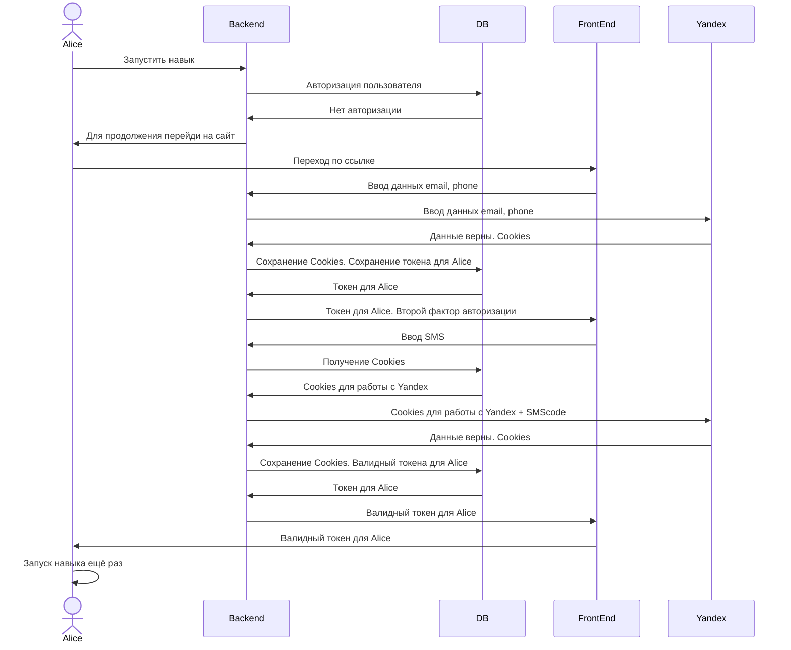

## Начало работы

### Предисловие

Мне предложили поучаствовать в создании какого-либо навыка для Яндекс Станции. Хакатон был рассчитан на публикацию навыка для города. Нужно улучшить взаимодействие тебя и твоей среды именно на улице. 

Мы придумали очень амбициозную идею и попытались её реализовать

### Что за идея

Поскольку я лично не часто пользуюсь службами доставки, но мне было интересно посмотреть в быстро развивающуюся платформу, мне показалось неоюбычным попросить и заказывать продукты именно через Яндекс Алису. 

Хотелось просто попросить Алису о покупке кофе, пока идёшь до дома в холодную погода и она быстро это сделает без твоего вмешательства.

### Что хотелось сделать за хакатон

Процесс напоминает чек-лист из пунктов

1. Навык должен был авторизировать человека
2. Подсказать человеку, что для покупки через Яндекс Лавку нужно привязывать карту
3. Спросить о том, куда доставлять заказ или предложить использовать последнее местоположение
4. Сформировать корзину заказа в ближайшем "дарк-стор"
5. Оформить заказ, списать деньги с карты
6. Рассказать о статусах прошедших заказов через навык.

Поддерживать хотели в рамках MVP только заказы кофе, с уточнениями объёма и типа напитка

### Стек и технологии

Использовали всё что попадалось под руку. Сценарии и кейсы описывали в Miro, для того, чтобы понимать, как продвигается каждый из разделов

Реализация програмной части была очень интересной, с точки зрения подключения карты и списывания денег (в рамках MVP)

1. Python3 - основной язык программирования
2. Aiohttp - библиотека для взаимодействия с Yandex сервисами по Http
3. Postgresql/pg_trgm - Основная БД с возможностью полнотектового поиска

## Work

### Авторизация

В проекте получилось авторизировать человека по посадочной странице, которая является фейковой. Это сделано для того, чтобы в рамках хакатона была возможность создавать реальные заказы и платить реальными деньгами за него

1. В начале навык предупреждает о том, что для его работы необходима авторизация

2. Мы попадаем на посадочную страницу, в которой вводим наши логин и пароль

3. После успешной авторизации, нам сообщают о необходимости привязки карты к нашему Yandex аккаунту

### Сохранение покупок и адреса

Для того, чтобы ускорить наши запросы, вся информация о заказах и адресах сохраняется в Postgresql и Redis

1. Система предлагает выбрать последний адрес

2. Если человек совершает заказ в другое место, уточняем адрес

3. Или уточняем адрес, если улицы в городе не существует

4. После подтврждения на данное сообщение, система предложит сделать заказ

### Формирование заказа

После того, как мы узнали о текущем адресе, мы можем найти ближайший дарк-стор и уточнить все товары, которые умеем искать

Основная проблема заказа в том, что для каждого дарк-стора (место, откуда привозится еда) различным является наименование товара. Поэтому мы нормализируем каждый из товаров и ищем код товара в нашей БД, предварительно сохраняя её сессию как открытый магазин

1. Ищем товары в Yandex и соотносим с нашими товарами в БД
2. После каждого текстового запроса, мы можем уточнить товар по его характеристикам в БД
3. После того как мы подтверждаем, товар сохраняется в три корзины: Yandex, Redis, DB
Это необходимо, для того, чтобы в момент совершения покупки наша корзина уже была подготовлена, мы быстро меняли заказ из нашего состояния или в момент ошибки, нашли необходимый товар в БД
4. После - совершаем платёж

### А когда приедет

Система хранения заказов

После того, как заказ создан и находится в работе - можно уточнять статус заказа путем опроса Yandex. Все совершаемые покупки из нашего приложения хранятся в истории заказов Yandex.

## Схемы

1. Авторизация

